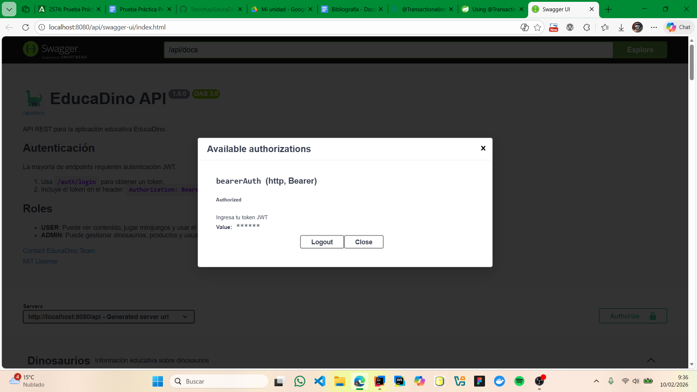
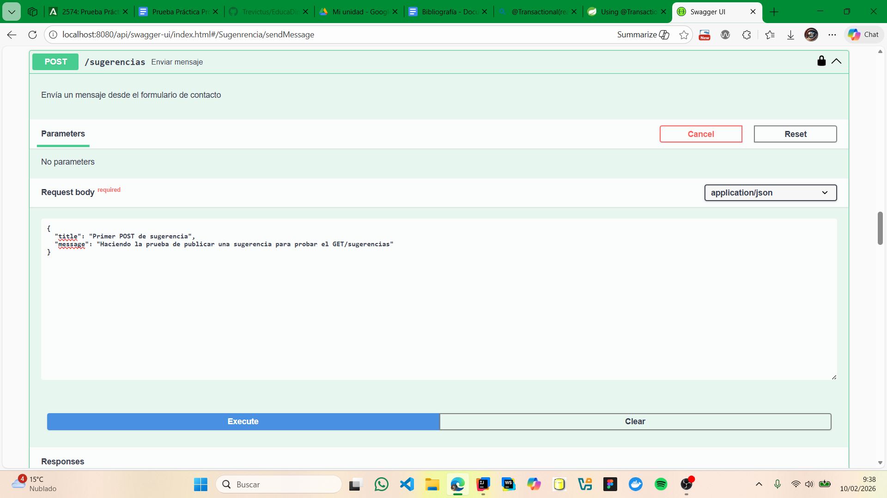
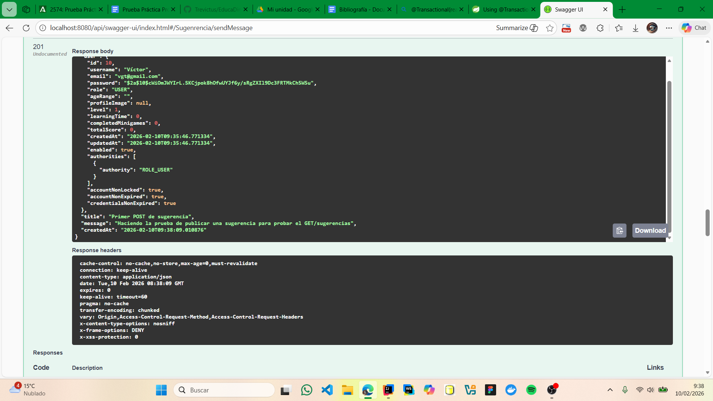
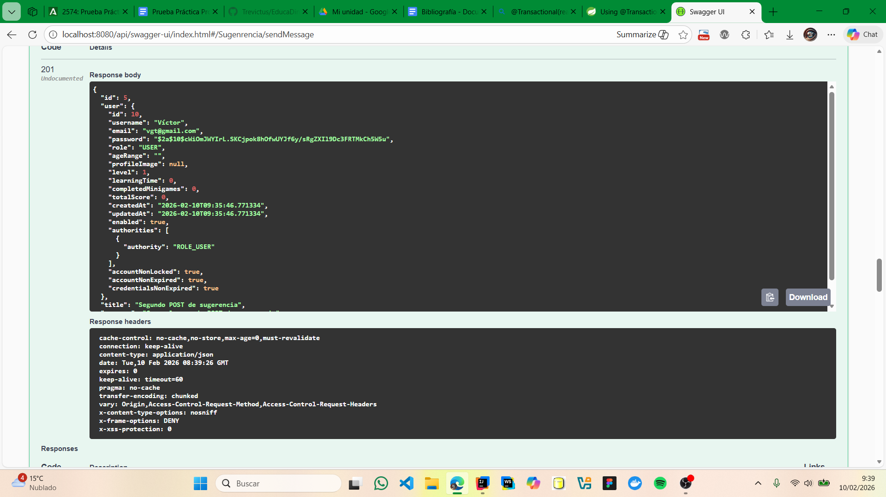
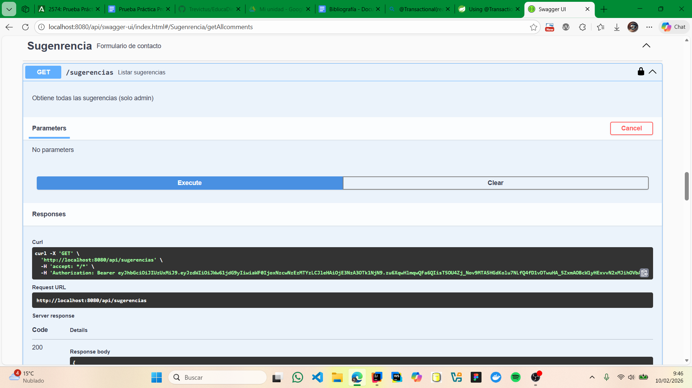
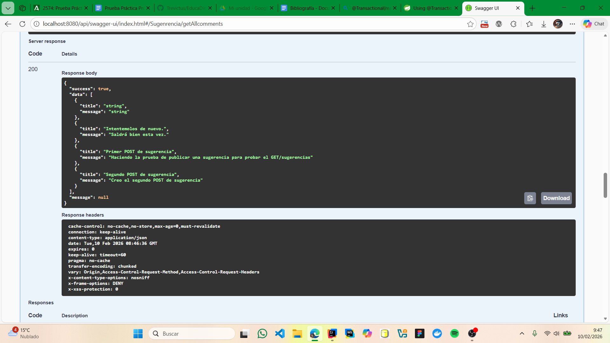

# Prueba Practica DWES
**Víctor Gómez Tejada**

## Qué endpoint has creado y por qué.
He creado un endpoint para obtener el listado de todas las sugerencias creadas tanto por usuarios cómo por administradores. Ya disponía del método crear una sugerencia en SugerenciaController, pero no disponía de uno para listar todas las sugerencias existentes. Por eso este endpoint facilita la revision de las sugerencias para en un futuro poder añadir una implementación de borrado de sugerencias y así gestionarlas de manera eficiente.  
```java
@Transactional
  public List<SugerenciaCreateRequest> getAllComments() {
    return sugerenciaRepository.findAll().stream()
            .map(s -> new SugerenciaCreateRequest(s.getTitle(), s.getMessage()))
            .toList();
  }
```

```java
/**
   * Obtiene todas las sugerencias solo ADMIN
   * Listado de sugerencias
   */
  @GetMapping()
  @PreAuthorize("hasAnyRole('USER', 'ADMIN')")
  @Operation(summary = "Listar sugerencias", description = "Obtiene todas las sugerencias")
  public ResponseEntity<ApiResponse<List<SugerenciaCreateRequest>>> getAllcomments() {
    return ResponseEntity.ok(ApiResponse.success(sugerenciaService.getAllComments()));
  }
```


## Cómo has implementado la seguridad.
Pues en principio decidí añadir solo ADMIN a hasAnyRole() en la anotación @PreAuthorize para que solo pudiesen acceder a ese método los Admins, tras esto en el archivo SecurityConfig decidí añadir los requestMatchers para el método GET de las sugerencias dando acceso al rol ADMIN. Debido a complicaciones de las respuestas Http 401 que recibía al probar el endpoint con los roles USER y ADMIN, decidí añadir el rol USER a los requestMatchers para el método GET de las sugerencias, de esta manera ambos roles pueden acceder al endpoint y no recibo respuestas Http 401. Para finalizar he probado los métodos POST y GET de las sugerencias con Swagger y funcionan correctamente.
```java
// Sugerencias
        .requestMatchers(HttpMethod.GET, "/api/sugerencias/**").hasAnyRole("USER", "ADMIN")
        .requestMatchers(HttpMethod.POST, "/api/sugerencias/**")
        .hasAnyRole("USER", "ADMIN")
```

## Capturas o comandos para probarlo.
Comandos para lanzar el backend:
```
mvn spring-boot-run
```

Mediante los endpoints registré un usuario y con swagger le di autorización para acceder a los endpoints:


Luego hice la prueba de los post de sugerencia para tener una lista contundente y ambos tuvieron respuesta correcta:





Por último para utilizar el método GET de las sugerencias, mediante swagger se ejecutó correctamente enviando el código 200:



## Bibliografía.
El problema de ; trás anotaciones.
https://stackoverflow.com/questions/45526647/annotations-are-not-allowed-here
