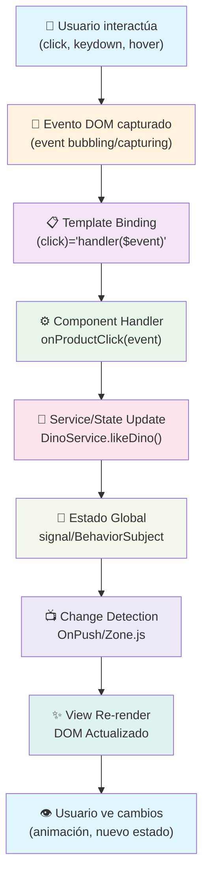

# EducaDino

Proyecto final sobre AppWeb educativa
Desplegado en: https://trevictus.github.io/EducaDino/

---

# Guía de Configuración y Ejecución del Proyecto

Sigue los siguientes pasos para descargar, instalar y ejecutar el proyecto en tu entorno local.

## 1. Descargar el repositorio
Clona el repositorio desde GitHub utilizando la terminal o descárgalo como archivo ZIP.

```bash
git clone https://github.com/Trevictus/EducaDino.git
```

## 2. Abrir con WebStorm
Abre el proyecto con WebStorm.

## 3. Instalar dependencias
Abre la terminal desde el **directorio raíz** del proyecto y ejecuta:

```bash
npm install
```

## 4. Iniciar el proyecto
Con la terminal abierta en el directorio raíz, ejecuta el siguiente comando para levantarlo en el puerto 4200:

```bash
npm start
```

---

## FASE 1: MANIPULACIÓN DEL DOM Y EVENTOS

### Arquitectura de eventos

La arquitectura de eventos en esta aplicación Angular sigue el patrón unidireccional de datos, utilizando bindings de eventos nativos del DOM como `(click)`, `(keydown)` y `(pointerdown)` directamente en las plantillas de componentes standalone.

Los eventos se capturan con la sintaxis `(eventName)="handler($event)"`, donde `$event` proporciona acceso al objeto nativo del evento. Esta aproximación aprovecha Zone.js para detección de cambios automática.

Para flujos complejos, se centralizan eventos en servicios inyectables que usan `EventEmitter` o RxJS `Subjects`.

### Diagrama de flujo de eventos principales (Flujo Completo)



### Ejemplo Real: Click en "Marcar como Favorito" (CardComponent)

**Código del Template:**
```html
<!-- card.html -->
<button 
  (click)="onLikeClick($event)" 
  [attr.aria-label]="'Marcar ' + dino.name + ' como favorito'"
  class="card__like-btn">
  <span>❤️</span>
</button>
```

**Código del Componente:**
```typescript
// card.ts
export class CardComponent {
  @Input() dino!: Dinosaur;
  @Output() likeToggled = new EventEmitter<Dinosaur>();

  constructor(private dinoService: DinoService) {}

  onLikeClick(event: MouseEvent): void {
    // 1️⃣ Acceso al evento nativo
    event.stopPropagation(); // Prevenir que suba el árbol DOM
    
    // 2️⃣ Actualizar estado global
    this.dinoService.likeDino(this.dino.id);
    
    // 3️⃣ Emitir evento al componente padre
    this.likeToggled.emit(this.dino);
  }
}
```

**Flujo de Datos Resultante:**
```
┌─────────────────────────────────────────────────────────┐
│ 1️⃣ Usuario hace click en botón ❤️                       │
│    └─> MouseEvent { type: 'click', target: button }     │
├─────────────────────────────────────────────────────────┤
│ 2️⃣ onLikeClick(event) en CardComponent                  │
│    └─> event.stopPropagation() (evita bubbling)        │
├─────────────────────────────────────────────────────────┤
│ 3️⃣ dinoService.likeDino(id) actualiza signal            │
│    └─> favoritesDinos = computed(() => ...)            │
├─────────────────────────────────────────────────────────┤
│ 4️⃣ likeToggled.emit() notifica al padre (HomeComponent) │
│    └─> @Output() permite comunicación hacia arriba      │
├─────────────────────────────────────────────────────────┤
│ 5️⃣ Change Detection marca tarjeta para actualizar       │
│    └─> OnPush + Zone.js detecta cambios                 │
├─────────────────────────────────────────────────────────┤
│ 6️⃣ DOM se re-renderiza: clase .card--liked se aplica    │
│    └─> CSS animación suaviza cambio visual              │
├─────────────────────────────────────────────────────────┤
│ 7️⃣ localStorage se actualiza (si persistencia habilitada)│
│    └─> Datos persisten entre sesiones                   │
└─────────────────────────────────────────────────────────┘
```

### Control de Propagación y Prevención de Eventos

| Método               | Descripción                                           | Ejemplo en EducaDino |
|:---------------------|:------------------------------------------------------|:----------------------|
| `stopPropagation()`  | Evita que el evento suba (bubbling) por el árbol DOM | Click en card no activa click del contenedor padre |
| `preventDefault()`   | Cancela la acción por defecto del navegador           | Form submit, link href, scrolling con wheel |
| `stopImmediateProp()`| Detiene el evento y otros listeners en el mismo elem.  | Modal: evita clicks detrás en fondo |
| `$event.target`      | Elemento que disparó el evento                        | Verificar si es el botón correcto |
| `$event.currentTarget`| Elemento al que está vinculado el listener            | Siempre es el elemento con (click) |

**Ejemplo: Prevención en Modal**
```typescript
// modal.ts
onBackdropClick(event: MouseEvent): void {
  // Solo cerrar si hace click EXACTAMENTE en el backdrop
  if (event.currentTarget === event.target) {
    this.closeModal();
  }
  // Si hace click dentro del modal (en un child), no ocurre nada
}
```

```html
<!-- modal.html -->
<div class="modal__backdrop" (click)="onBackdropClick($event)">
  <div class="modal__content">
    <!-- Los clicks aquí NO cierran el modal gracias al check -->
  </div>
</div>
```

### Diagrama de Propagación y Captura de Eventos

```
                    CAPTURING PHASE
                          ↓
        ┌─────────────────────────────────┐
        │     Window (document root)       │
        │          ↓ (captura)             │
        │     ┌─────────────────┐          │
        │     │   body          │          │
        │     │     ↓ (captura) │          │
        │     │  ┌──────────┐   │          │
        │     │  │ .modal   │   │          │
        │     │  │  ↓(cap.) │   │          │
        │     │  │ ┌──────┐ │   │          │
        │     │  │ │button│ │   │          │
        │     │  │ │🎯    │ │   │          │
        │     │  │ └──────┘ │   │          │
        │     │  └──────────┘   │          │
        │     └─────────────────┘          │
        └──────────────────────────────────┘
                    ↑
              BUBBLING PHASE
        (stopPropagation() aquí)

🎯 Target Phase: El evento alcanza el elemento

Orden de ejecución:
1. Capturing: window → body → .modal → button
2. Target: button (listeners en orden de registro)
3. Bubbling: button → .modal → body → window
```

### Leyenda y Explicación Visual

| Símbolo | Significado | Notas |
|:--------|:-----------|:------|
| 👤 | Usuario / Interacción | Acción del usuario en la interfaz |
| 🎯 | Evento DOM | Disparado por el navegador |
| 📋 | Template Binding | Vinculación en la plantilla Angular |
| ⚙️ | Component Handler | Método del componente que maneja el evento |
| 💾 | Service/State | Lógica de negocio, actualización de estado |
| 🔄 | Change Detection | Mecanismo de Angular para detectar cambios |
| ✨ | View Re-render | Actualización del DOM |
| 👁️ | Usuario ve cambios | Resultado visual para el usuario |

### Ejemplos de Eventos Implementados en EducaDino

**1. Click en Botón "Marcar Favorito"** (CardComponent)
- **Tipo**: `click`
- **Prevención**: `stopPropagation()`
- **Servicio**: `DinoService.likeDino()`
- **Estado**: `signal<Dinosaur[]>`

**2. Validación de Formulario en Tiempo Real** (RegisterForm)
- **Tipo**: `keyup` / `blur`
- **Prevención**: Ninguna
- **Servicio**: `ValidatorsService`
- **Estado**: `FormControl.statusChanges`

**3. Toggle de Tema Oscuro** (ThemeToggle)
- **Tipo**: `click`
- **Prevención**: Ninguna
- **Servicio**: `ThemeService`
- **Persistencia**: `localStorage`

**4. Cerrar Modal al hacer Click en Backdrop**
- **Tipo**: `click`
- **Prevención**: Verificar `event.target === event.currentTarget`
- **Servicio**: `CommunicationService.emit('closeModal')`
- **Efecto**: Animar cierre con CSS `transition`

**5. Envío de Formulario de Contacto** (ContactForm)
- **Tipo**: `submit` (en `<form>`)
- **Prevención**: `preventDefault()`
- **Servicio**: `CommunicationService` + `LoadingService`
- **Flujo**: Form → Service → Toast (éxito/error)

### Tabla Completa de Compatibilidad de Eventos

#### Evento: `click`
- **Descripción**: Dispara cuando el usuario hace clic (botón izquierdo del ratón)
- **Propagación**: Bubbles (sube por el árbol DOM)
- **Cancelable**: Sí (`preventDefault()`)
- **Casos en EducaDino**:
  - Click en "Marcar como Favorito" (CardComponent)
  - Click en botón "Hamburguesa" (HeaderComponent)
  - Toggle de tema oscuro (ThemeToggleComponent)
  - Cerrar modal (ModalComponent)

| Navegador | Versión | Soporte | Notas |
|:----------|:--------|:--------|:------|
| Chrome    | 1+      | ✓ Full  | Estándar desde siempre |
| Firefox   | 1+      | ✓ Full  | Estándar desde siempre |
| Safari    | 1+      | ✓ Full  | Estándar desde siempre |
| Edge      | 12+     | ✓ Full  | Basado en Chromium (79+) |
| IE 11     | 11      | ✓ Full  | Soporte completo |

---

#### Evento: `keydown` y `keyup`
- **Descripción**: Se dispara cuando el usuario presiona/suelta una tecla
- **Propagación**: Bubbles (sube por el árbol DOM)
- **Cancelable**: Sí (especialmente importante con `preventDefault()`)
- **Casos en EducaDino**:
  - Validación en tiempo real (RegisterForm, ContactForm)
  - Navegación por teclado (Escape para cerrar modal)
  - Envío de formulario (Enter en campos)

| Navegador | Versión | Soporte | Notas |
|:----------|:--------|:--------|:------|
| Chrome    | 1+      | ✓ Full  | Todas las teclas incluidas |
| Firefox   | 1+      | ✓ Full  | Todas las teclas incluidas |
| Safari    | 1+      | ✓ Full  | Compatibilidad total |
| Edge      | 12+     | ✓ Full  | Basado en Chromium |
| IE 11     | 11      | ✓ Full  | Soporte completo |

**Propiedad útil**: `event.key` (devuelve la tecla presionada)
```typescript
onKeyDown(event: KeyboardEvent): void {
  if (event.key === 'Escape') {
    this.closeModal(); // Cerrar modal con Escape
  }
}
```

---

#### Evento: `focus` y `blur`
- **Descripción**: `focus` cuando el elemento obtiene foco; `blur` cuando lo pierde
- **Propagación**: No bubbles (no sube)
- **Cancelable**: No
- **Casos en EducaDino**:
  - Validación de formularios al perder foco (RegisterForm)
  - Estilos visuales de foco para accesibilidad
  - Trigger de validadores asíncronos (`updateOn: 'blur'`)

| Navegador | Versión | Soporte | Notas |
|:----------|:--------|:--------|:------|
| Chrome    | 1+      | ✓ Full  | Estándar DOM |
| Firefox   | 1+      | ✓ Full  | Estándar DOM |
| Safari    | 1+      | ✓ Full  | Compatible |
| Edge      | 12+     | ✓ Full  | Basado en Chromium |
| IE 11     | 11      | ✓ Full  | Soporte completo |

**Nota importante**: Para accesibilidad, asegúrate de tener estilos `:focus-visible` en CSS.

---

#### Evento: `input` y `change`
- **Descripción**: `input` se dispara mientras escribes; `change` solo cuando pierdes foco
- **Propagación**: Bubbles (para `input` en algunos navegadores)
- **Cancelable**: No
- **Casos en EducaDino**:
  - Validación en tiempo real en campos de formulario
  - Búsqueda de dinosaurios mientras escribes
  - Cálculo de precio total en OrderForm

| Navegador | Versión | Soporte | Notas |
|:----------|:--------|:--------|:------|
| Chrome    | 1+      | ✓ Full  | `input` desde Chrome 17+ |
| Firefox   | 1+      | ✓ Full  | `input` desde Firefox 3+ |
| Safari    | 1+      | ✓ Full  | `input` desde Safari 5.1+ |
| Edge      | 12+     | ✓ Full  | Ambos eventos soportados |
| IE 11     | 11      | ✓ Full  | IE9+ soporta `input` |

**Diferencia clave**:
```typescript
// `input` - Dispara mientras escribes (en tiempo real)
<input (input)="onInputChange($event)">

// `change` - Dispara solo al perder foco
<input (change)="onFormChange($event)">
```

---

#### Evento: `submit` (en `<form>`)
- **Descripción**: Se dispara cuando se envía un formulario (click en submit o Enter)
- **Propagación**: No bubbles
- **Cancelable**: Sí (`preventDefault()` es crítico aquí)
- **Casos en EducaDino**:
  - Envío de ContactForm
  - Envío de RegisterForm
  - Envío de OrderForm

| Navegador | Versión | Soporte | Notas |
|:----------|:--------|:--------|:------|
| Chrome    | 1+      | ✓ Full  | Estándar HTML |
| Firefox   | 1+      | ✓ Full  | Estándar HTML |
| Safari    | 1+      | ✓ Full  | Compatible |
| Edge      | 12+     | ✓ Full  | Basado en Chromium |
| IE 11     | 11      | ✓ Full  | Soporte completo |

**Patrón Angular Reactive Forms**:
```typescript
<form [formGroup]="contactForm" (ngSubmit)="onSubmit()">
  <!-- formGroup y ngSubmit previenen el refresh automático -->
</form>
```

---

#### Evento: `mouseenter` y `mouseleave`
- **Descripción**: `mouseenter` cuando el ratón entra en el elemento; `mouseleave` cuando sale
- **Propagación**: No bubbles (a diferencia de `mouseover`/`mouseout`)
- **Cancelable**: No
- **Casos en EducaDino**:
  - Efectos hover en cards (CardComponent)
  - Tooltip al pasar sobre elementos
  - Menú desplegable en header

| Navegador | Versión | Soporte | Notas |
|:----------|:--------|:--------|:------|
| Chrome    | 1+      | ✓ Full  | Introducido con IE9+ |
| Firefox   | 1+      | ✓ Full  | Soporte desde siempre |
| Safari    | 1+      | ✓ Full  | Compatible |
| Edge      | 12+     | ✓ Full  | Basado en Chromium |
| IE 11     | 11      | ✓ Full  | IE9+ soportado |

**Ventaja sobre `mouseover`**: No propagan el evento a elementos padre.

---

#### Evento: `transitionend`
- **Descripción**: Se dispara cuando una transición CSS finaliza
- **Propagación**: Bubbles
- **Cancelable**: No
- **Casos en EducaDino**:
  - Animación suave al cambiar de tema
  - Cierre de modal con animación
  - Cambio de estado en tarjetas de dinosaurios

| Navegador | Versión | Soporte | Notas |
|:----------|:--------|:--------|:------|
| Chrome    | 26+     | ✓ Full  | Con prefijo desde 2-25 |
| Firefox   | 16+     | ✓ Full  | Con prefijo desde 4-15 |
| Safari    | 9+      | ✓ Full  | Con prefijo desde 3.1-8 |
| Edge      | 12+     | ✓ Full  | Basado en Chromium (26+) |
| IE 11     | 11      | ✗ No    | Usar `animationend` alternativa |

**Polyfill para transiciones**:
```typescript
// Escuchar tanto prefijo como no prefijo
element.addEventListener('transitionend', onTransitionEnd);
element.addEventListener('webkitTransitionEnd', onTransitionEnd); // Para Safari antiguo
```

---

#### Evento: `change` en MediaQueryList (`matchMedia`)
- **Descripción**: Se dispara cuando cambia una media query (ej: oscuridad del sistema)
- **Propagación**: N/A (no es un evento DOM tradicional)
- **Cancelable**: No
- **Casos en EducaDino**:
  - Detectar cambio de preferencia de tema oscuro del sistema
  - Responder a cambios en `prefers-color-scheme: dark`
  - Adaptar interfaz a cambios de viewport (media queries)

| Navegador | Versión | Soporte | Notas |
|:----------|:--------|:--------|:------|
| Chrome    | 9+      | ✓ Full  | Listener desde Chrome 38+ |
| Firefox   | 6+      | ✓ Full  | Listener desde Firefox 55+ |
| Safari    | 5.1+    | ✓ Full  | Listener desde Safari 14.1+ |
| Edge      | 12+     | ✓ Full  | Basado en Chromium |
| IE 11     | 11      | ✗ No    | Usar fallback a escucha manual |

**Implementación en ThemeService (EducaDino)**:
```typescript
// Escuchar cambios en la preferencia del sistema
window.matchMedia('(prefers-color-scheme: dark)').addEventListener('change', (e) => {
  if (!localStorage.getItem(this.STORAGE_KEY)) {
    this.themeSignal.set(e.matches ? 'dark' : 'light');
  }
});
```

**Polyfill para IE 11**:
```typescript
// Fallback simple para IE 11
if (!window.matchMedia) {
  console.log('matchMedia no soportado, usando tema por defecto light');
  // Usar tema por defecto
}
```

---

#### Evento: `animationend`
- **Descripción**: Se dispara cuando una animación CSS finaliza
- **Propagación**: Bubbles
- **Cancelable**: No
- **Casos en EducaDino**:
  - Remover elemento después de animación de salida (fade-out)
  - Toast de notificaciones que desaparece con animación
  - Modal que se anima al abrir/cerrar

| Navegador | Versión | Soporte | Notas |
|:----------|:--------|:--------|:------|
| Chrome    | 26+     | ✓ Full  | Con prefijo desde 2-25 |
| Firefox   | 16+     | ✓ Full  | Con prefijo desde 5-15 |
| Safari    | 9+      | ✓ Full  | Con prefijo desde 4-8 |
| Edge      | 12+     | ✓ Full  | Basado en Chromium (26+) |
| IE 11     | 11      | ✗ No    | No soportado, usar `setTimeout` |

**Polyfill para IE 11**:
```typescript
// Fallback: usar setTimeout en lugar de animationend
setTimeout(() => {
  this.removeElement();
}, 1000); // Duración de la animación en CSS
```

---

### Tabla Resumen Comparativo

| Evento | Chrome | Firefox | Safari | Edge | IE 11 | Propagación | Cancelable |
|:-------|:------:|:-------:|:------:|:----:|:-----:|:-----------:|:----------:|
| `click` | ✓ | ✓ | ✓ | ✓ | ✓ | Bubbles | Sí |
| `keydown/keyup` | ✓ | ✓ | ✓ | ✓ | ✓ | Bubbles | Sí |
| `focus/blur` | ✓ | ✓ | ✓ | ✓ | ✓ | No | No |
| `input/change` | ✓ | ✓ | ✓ | ✓ | ✓ | Varies | No |
| `submit` | ✓ | ✓ | ✓ | ✓ | ✓ | No | Sí |
| `mouseenter/leave` | ✓ | ✓ | ✓ | ✓ | ✓ | No | No |
| `transitionend` | ✓ | ✓ | ✓ | ✓ | ✗ | Bubbles | No |
| `matchMedia change` | ✓ | ✓ | ✓ | ✓ | ✗ | N/A | No |
| `animationend` | ✓ | ✓ | ✓ | ✓ | ✗ | Bubbles | No |

### Notas sobre Fallbacks y Polyfills

**Para navegadores sin soporte de `transitionend` / `animationend` (IE 11)**:
```typescript
// Usar duración de CSS como fallback
const duration = getComputedStyle(element).transitionDuration;
const durationMs = parseFloat(duration) * 1000;

setTimeout(() => {
  onAnimationComplete();
}, durationMs);
```

**Para `matchMedia` en IE 11**:
```typescript
// Verificar soporte y usar fallback
if ('matchMedia' in window) {
  // Usar matchMedia
} else {
  // Fallback: usar tema por defecto
  console.warn('matchMedia no soportado, tema por defecto: light');
}
```

**Zone.js Compatibility**: Angular automáticamente usará Zone.js para envolver todos estos eventos y dispara Change Detection. No se requieren polyfills adicionales para la mayoría de navegadores modernos.

---

## FASE 2: ARQUITECTURA Y SERVICIOS

### Diagrama de flujo de datos

```
┌─────────────────────────────────────────────────────────────────┐
│                        FLUJO DE DATOS                           │
├─────────────────────────────────────────────────────────────────┤
│                                                                 │
│  ┌─────────┐    ┌───────────┐    ┌─────────┐    ┌─────────┐    │
│  │ Usuario │ -> │ Componente│ -> │ Servicio│ -> │ Estado  │    │
│  │ (click) │    │  (Dumb)   │    │ (Smart) │    │ (Signal)│    │
│  └─────────┘    └───────────┘    └─────────┘    └─────────┘    │
│                       │                              │          │
│                       └──────────────────────────────┘          │
│                              Re-render (Vista)                  │
│                                                                 │
└─────────────────────────────────────────────────────────────────┘
```

### Patrón "Smart Services / Dumb Components"

**Dumb Components (Presentacionales):**
- Solo reciben datos vía `@Input()` y emiten eventos vía `@Output()`
- No tienen lógica de negocio
- Usan Signals para estado local de UI
- Ejemplo: `ButtonComponent`, `CardComponent`, `AlertComponent`

**Smart Services (Lógica):**
- Centralizan datos y lógica de negocio
- Usan `BehaviorSubject` para estado reactivo
- Exponen Signals para consumo en templates
- `providedIn: 'root'` para singleton global
- Ejemplo: `ToastService`, `LoadingService`, `DinoService`

### Servicios principales

| Servicio               | Propósito                                            | Patrón                                    |
|:-----------------------|:-----------------------------------------------------|:------------------------------------------|
| `CommunicationService` | Comunicación entre componentes hermanos              | BehaviorSubject + Observable              |
| `ToastService`         | Notificaciones globales (success, error, warning)    | BehaviorSubject + Signal + Auto-dismiss   |
| `LoadingService`       | Estados de carga global con contador de peticiones   | BehaviorSubject + Signal + Request Counter|
| `DinoService`          | Datos centralizados de dinosaurios                   | BehaviorSubject + Signal + Computed       |
| `ThemeService`         | Modo oscuro/claro con persistencia                   | Signal + localStorage + matchMedia        |

### Uso de Signals vs Observables

**Signals (Angular 17+):**
- Para estado local en templates: `isLoading = signal(false)`
- Para computed values: `favorites = computed(() => this.dinos().filter(d => d.liked))`
- Mejor rendimiento en templates sin `async` pipe

**Observables (RxJS):**
- Para streams de datos asíncronos
- Para operadores complejos (debounce, switchMap, etc.)
- Integración con HTTP Client

---

## FASE 3: FORMULARIOS AVANZADOS

### Tabla de validadores implementados

| Validador                      | Tipo        | Descripción                                                        |
|:-------------------------------|:------------|:-------------------------------------------------------------------|
| `passwordStrength()`           | Síncrono    | Requiere mayúsculas, minúsculas, números y símbolos. Mínimo 8 car. |
| `nifValidator()`               | Síncrono    | Valida formato (8 dígitos + letra) y letra correcta del DNI.       |
| `matchPasswords(ctrl1, ctrl2)` | Cross-Field | Validador de grupo que compara dos campos de contraseña.           |
| `spanishPhone()`               | Síncrono    | Valida teléfono español (9 dígitos, empieza por 6, 7 o 9).         |
| `username()`                   | Síncrono    | Solo letras, números y guiones bajos. Entre 3 y 20 caracteres.     |
| `uniqueEmailValidator()`       | Asíncrono   | Simula llamada a API para verificar email único.                   |
| `usernameAvailableValidator()` | Asíncrono   | Simula verificación de disponibilidad de username.                 |

### Funcionamiento del validador asíncrono

Los validadores asíncronos simulan llamadas a una API usando RxJS:

```typescript
uniqueEmailValidator(debounceTime: number = 800): AsyncValidatorFn {
  return (control: AbstractControl): Observable<ValidationErrors | null> => {
    const email = control.value?.toLowerCase().trim();

    if (!email) return of(null);

    // timer() actúa como debounce + delay de "red"
    return timer(debounceTime).pipe(
      switchMap(() => {
        // Simular respuesta del servidor
        const emailExists = this.existingEmails.includes(email);
        return emailExists
          ? of({ emailTaken: { message: 'Este email ya está registrado' } })
          : of(null);
      }),
      catchError(() => of(null))
    );
  };
}
```

**UX implementada:**
- Estado `pending` con mensaje "Comprobando..."
- Clase CSS `.form-field--pending` para feedback visual
- Se puede usar `updateOn: 'blur'` para validar solo al perder foco

### Definición del FormArray (OrderForm)

```typescript
private initForm(): void {
  this.orderForm = this.fb.group({
    nombreCliente: ['', [Validators.required]],
    emailCliente: ['', [Validators.required, Validators.email]],
    direccion: ['', [Validators.required]],

    // FormArray de items del pedido
    items: this.fb.array([], [Validators.required, Validators.minLength(1)]),

    notas: ['']
  });

  this.addItem(); // Añadir un item inicial
}

// Getter para acceder al FormArray
get items(): FormArray {
  return this.orderForm.get('items') as FormArray;
}

// Crear FormGroup para cada item
private createItemFormGroup(): FormGroup {
  return this.fb.group({
    producto: ['', [Validators.required]],
    cantidad: [1, [Validators.required, Validators.min(1)]],
    precio: [0, [Validators.required, Validators.min(0.01)]]
  });
}

// Añadir item al array
addItem(): void {
  this.items.push(this.createItemFormGroup());
}

// Eliminar item por índice
removeItem(index: number): void {
  this.items.removeAt(index);
}
```

### Componentes de formulario creados

| Componente     | Ubicación              | Características                                    |
|:---------------|:-----------------------|:---------------------------------------------------|
| `ContactForm`  | `shared/contact-form/` | Refactorizado a Reactive Forms con validaciones    |
| `RegisterForm` | `shared/register-form/`| Validadores custom, async y cross-field            |
| `OrderForm`    | `shared/order-form/`   | FormArray dinámico con cálculo de precio total     |
