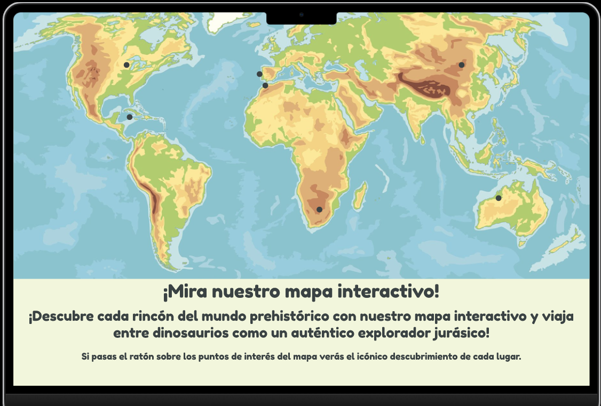
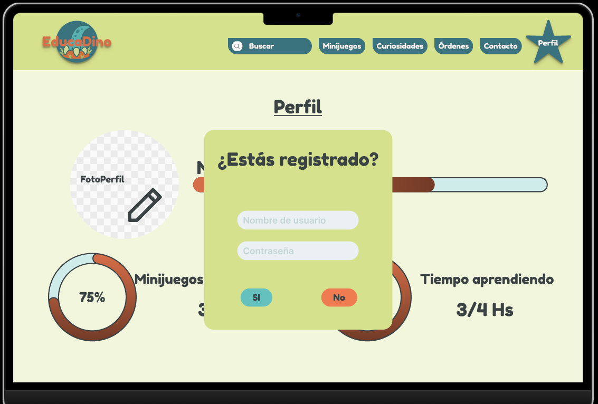
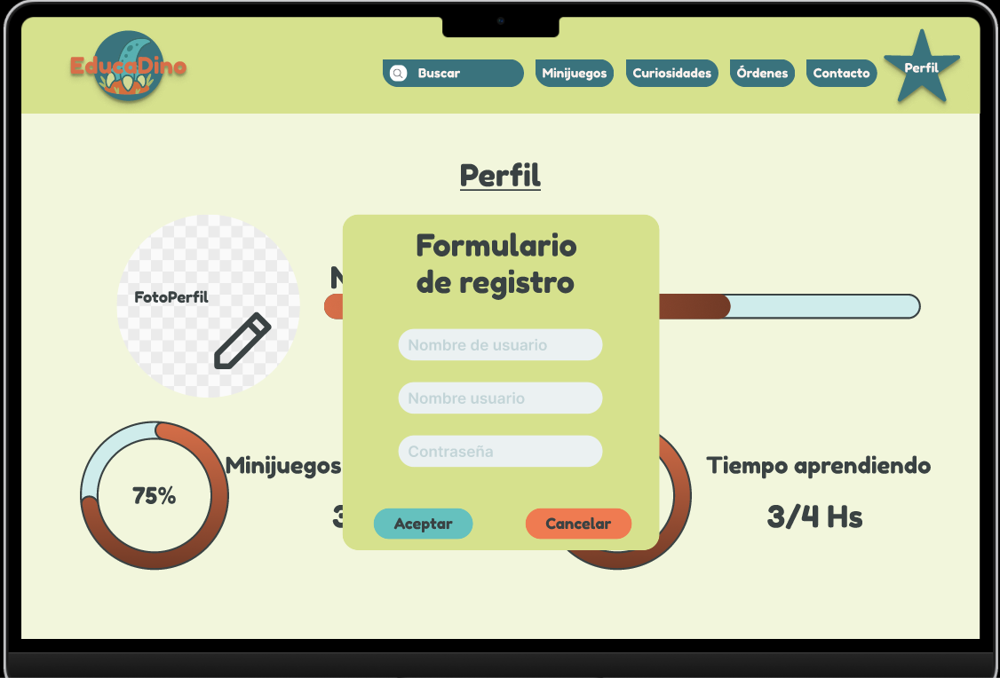
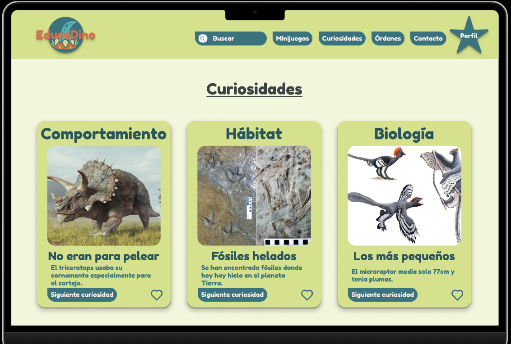
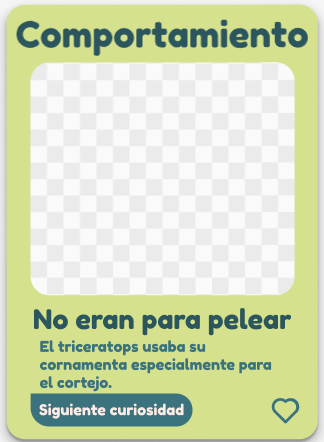
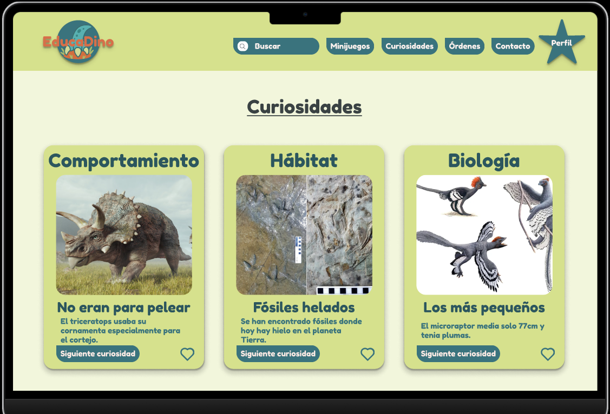
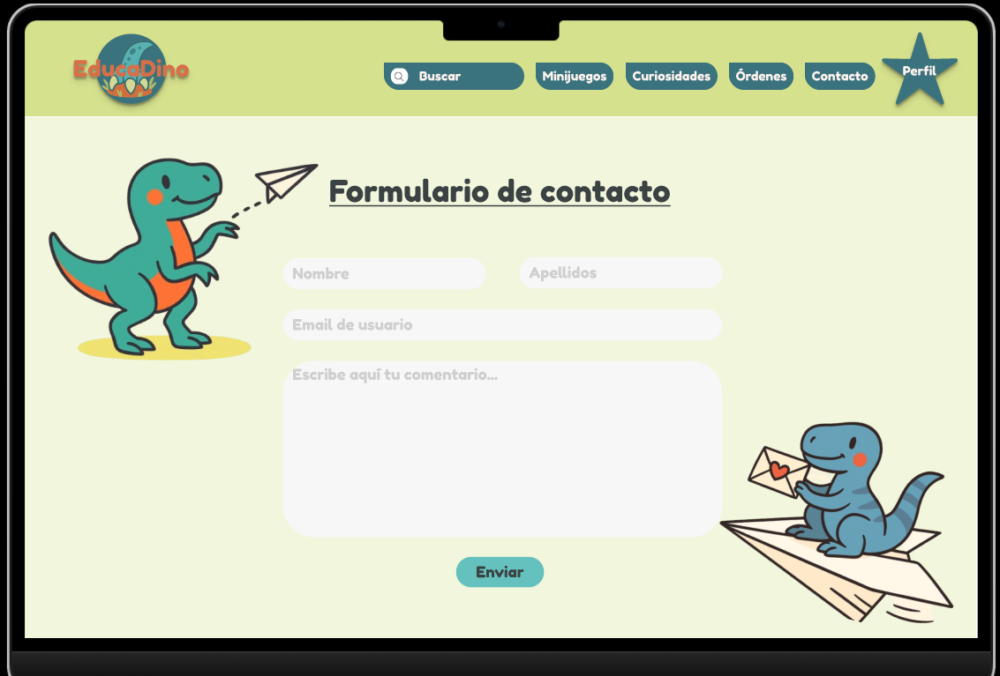

# EducaDino

Proyecto final sobre AppWeb educativa
Desplegado en: https://trevictus.github.io/EducaDino/

---

# Sección 1: Arquitectura CSS y Comunicación Visual

Esta sección documenta las decisiones de diseño, la estructura del código y las metodologías implementadas en el proyecto para asegurar escalabilidad, mantenimiento y coherencia visual.

---

## 1.1 Principios de Comunicación Visual

A continuación, se detalla cómo se aplican los 5 principios básicos del diseño en la interfaz, con ejemplos directos del prototipo en Figma.

### 1. Jerarquía
**Estrategia:**
En la página de inicio utilizamos una variable `--font-size-5xl: 48px;` en un texto bajo un mapa, para indicar claramente que el primer paso es interactuar con este para ver información educativa acerca de los dinosaurios. Este texto utiliza `<h1>` para destacar su importancia, mientras que los subtítulos y descripciones emplean tamaños de fuente más pequeños como `text-2xl` y `text-xl`, respectivamente. Además, el peso de la fuente se ajusta para enfatizar títulos (Bold) frente a párrafos (Regular), guiando así la atención del usuario de manera efectiva.


**Captura en Figma:**

*Descripción: En esta captura se observa cómo el Título H1 domina sobre la composicion incluso denotandose que está cortado y no termina la frase.*


*Descripción: Una vez que se lee el texto da a entender que el mapa es interactivo.*

### 2. Contraste
**Estrategia:**  
El color destaca los elementos de la interfaz, por lo que es importante que los colores sean contrastantes. Estos se usan para botones que llaman la atención del usuario indicando que puede clicar en ellos.  

En este proyecto se utilizan para los botones, los colores `primary-color: #3A737D;` de fondo y `--text-color-light: #FDF2EE;` de texto resaltante. Estos botones resaltan sobre un fondo `--background-color: #D6E18D;` para que el usuario esté dispuesto a pulsar en ellos ya que se ven con facilidad.  

En cuanto a los botones de "cancelar", "no", "aceptar" y "si" utilizan el color `--support-color: #EF7B51;` y el color `--secondary-color: #65C1BE;` con color de texto `--text-color: #3A4243;` llamando la atención de una acción importante con texto oscuro sobre fondo claro. El usuario sabe que debe pulsar el botón.

**Captura en Figma:**  

*Descripción: El botón de "Minijuegos" junto a los demás utilizan el contraste de colores para resaltar sobre el fondo*  

**Captura en Figma:**  

*Los botones de "Cancelar" y "No" utilizan otro tipo de contraste para resaltar que son botones importantes, al igual que los botones de "Aceptar" y "Si".*

### 3. Alineación
**Estrategia:**  
Se emplea una alineación central para los títulos de sección "Curiosidades" y "Formulario de contacto" para equilibrar la página. El contenido se estructura mediante un sistema de Grid, donde las tarjetas se alinean horizontalmente compartiendo el mismo eje superior, creando orden y estabilidad.

**Captura en Figma:**

*Descripción: Las tarjetas están perfectamente alineadas y centradas en una guía de disposición.*

**Captura en Figma:**

*Descripción: Los elementos del formulario están perfectamente alineados a la izquierda siguiendo la guía de columnas.*

### 4. Proximidad
**Estrategia:**  
Los elementos relacionados se agrupan para formar unidades lógicas. En la tarjeta de curiosidad, el texto explicativo se mantiene cerca de su título correspondiente. El botón de "siguiente curiosidad" y el icono de "corazón" están agrupados en la zona inferior de la tarjeta, separados del texto informativo, indicando que son herramientas de interacción y no de lectura.  

**Captura en Figma:**  
  
*Descripción: El botón y el icono forman un bloque funcional separado del bloque de texto mediante espaciado.*

### 5. Repetición
**Estrategia:**
Para mantener la coherencia cognitiva, se repiten patrones visuales clave: el mismo radio de borde redondeado de 25px en tarjetas y botones, la misma paleta de colores y la misma tipografía `Fredoka One` para títulos. Esto permite al usuario aprender rápidamente cómo funciona la interfaz: "si tiene forma redondeada y es verde oscuro, es un botón".

**Captura en Figma:**  

*Descripción: La repetición de la estructura de las tarjetas crea un estilo visual consistente.*

**Captura en Figma:**  

*Descripción: La repetición de los radios de borde, paleta de colores y tipografía, también se dan en los formularios, aparte de en muchos otros elementos.*
---

## 1.2 Metodología CSS

Se utiliza la metodología **BEM (Block, Element, Modifier)** para mantener un código CSS modular, reutilizable y fácil de entender.

**BEM**, evita conflictos de especificidad. Hace que el HTML y el CSS sean auto-explicativos. Facilita el mantenimiento en equipos.


**Ejemplo de código con tarjeta de curiosidad:**
```scss
// 05-components/_card.scss

.dino-card {
  display: flex;
  flex-direction: column;

  background-color: var(--background-color);
  border-radius: var(--radius-xl);
  padding: var(--spacing-4);
  box-shadow: var(--shadow-md);

  /* Efecto al pasar el ratón */
  transition: transform var(--transition-fast);

  &:hover {
    transform: translateY(-5px);
    box-shadow: var(--shadow-lg);
  }

  /* Encabezado */
  &__category {
    font-family: var(--font-secondary); /* Fredoka One */
    font-size: var(--font-size-3xl);
    color: var(--primary-color-active);
    text-align: center;
    margin-bottom: var(--spacing-2);
  }

  /* Contenedor de la imagen */
  &__media {
    width: 100%;
    height: 200px;
    object-fit: cover;
    border-radius: var(--radius-lg);
    background-color: #fff;
    margin-bottom: var(--spacing-3);
  }

  /* Título específico */
  &__title {
    font-family: var(--font-secondary);
    font-size: var(--font-size-2xl);
    color: var(--primary-color-active);
    line-height: 1.1;
    margin-bottom: var(--spacing-2);
  }

  /* Texto descriptivo */
  &__description {
    font-family: var(--font-primary);
    font-size: var(--font-size-lg);
    color: var(--primary-color);
    margin-bottom: var(--spacing-4);
    flex-grow: 1; /* Esto hace que el texto ocupe el espacio disponible */
  }

  /* Botón y Corazón */
  &__footer {
    display: flex;
    justify-content: space-between;
    align-items: center;
    margin-top: auto;
  }

  /* Corazón */
  &__icon {
    color: var(--primary-color);
    font-size: 1.5rem;
    cursor: pointer;
    transition: color var(--transition-fast), transform var(--transition-fast);

    &.is-liked {
      color: var(--support-color); // Tu naranja (#EF7B51)
    }
  }
}
```
---
## 1.3 Organización de archivos

El proyecto utiliza la arquitectura **IInverted Triangle CSS** o **ITCSS**, organizando los estilos de menor a mayor especificidad. Esta estructura se refleja en el árbol de carpetas del proyecto:

**Estructura de Carpetas:**

```text
src/
└── styles/
    ├── 00-settings/
    │   └── _variables.scss      # Variables globales
    ├── 01-tools/
    │   └── _mixins.scss         # Mixins
    ├── 02-generic/
    │   └── _reset.scss          # Box-sizing
    ├── 03-elements/
    │   └── _base.scss           # Estilos de etiquetas HTML base
    ├── 04-objects/
    │   └── _layout.scss         # Contenedores y Grid
    ├── 05-components/           # Componentes con BEM
    │   ├── _buttons.scss        # Botones
    │   ├── _card.scss           # Tarjetas de dinosaurios
    │   └── _header.scss         # Barra de navegación
    └── 06-utilities/
        └── main.scss
```

1.  **Settings (`00-settings`):** Contiene variables de configuración, tokens de diseño de colores y fuentes, que no generan CSS por sí mismas.
2.  **Tools (`01-tools`):** Contiene mixins y funciones Sass que se reutilizarán en el proyecto.
3.  **Generic (`02-generic`):** Resetea los estilos del navegador (`_reset.scss`) para asegurar consistencia entre diferentes navegadores.
4.  **Elements (`03-elements`):** Define la apariencia base de las etiquetas HTML sin clases, como el estilo por defecto de `body` o `h1`.
5.  **Objects (`04-objects`):** Define patrones de estructura y esqueleto, como el sistema de grid y contenedores.
6.  **Components (`05-components`):** Aquí se construyen los widgets específicos de la interfaz con estética propia (`_card.scss`, `_header.scss`, `_buttons.scss`).
7.  **Utilities (`06-utilities`):** Clase con más especificidad.

---

## 1.4 Sistema de Design Tokens

A la identidad visual se le da forma mediante `00-settings/_variables.scss`. El diseño responde a la temática "Jurásica/Infantil":

* **Paleta de Color:**
  * `--primary-color` (#3A737D): Tono verde azulado oscuro para elementos principales y serios.
  * `--background-color` (#D6E18D): Tono amarillo verdoso claro para el fondo, suave para la vista.
  * `--support-color` (#EF7B51): Naranja arcilla para destacar alertas o elementos "favoritos", aportando calidez y contraste.
* **Tipografía:**
  * **Títulos (`--font-secondary`):** `'Fredoka One'`, fuente display redondeada y gruesa de carácter amigable.
  * **Cuerpo (`--font-primary`):** `'Baloo 2'`, fuente sans-serif legible y suave.
* **Bordes:**
  * Uso de radios grandes (`--radius-xl`) para evocar seguridad y suavidad, dirigido al público infantil.
* **Brakpoints:**  
  * Se ha adoptado una escala de breakpoints moderna y estandarizada similar a la de Tailwind CSS para asegurar la compatibilidad con los dispositivos actuales.
  * Esta escala cubre de manera fluida las transiciones de móvil (1 columna) a tablet (2 columnas) y escritorio (3/4 columnas), garantizando que el diseño sea Mobile-First y escale progresivamente.

---

## 1.5 Mixins y funciones

El archivo `01-tools/_mixins.scss` contiene herramientas Sass diseñadas para aplicar el principio DRY, estandarizando elementos y la lógica responsiva.

### 1. Mixin: `button-secondary`
Genera los estilos visuales y de comportamiento para los botones de la interfaz. Define bordes redondeados asimétricos, la tipografía, el espaciado y los hover y active.

* **Propósito:** Crear botones consistentes que utilizan las variables de color primario y fuentes secundarias, incluyendo animaciones de elevación al pasar el cursor.

    ```scss
    .btn-intro {
      @include button-secondary;
    }
    ```

### 2. Mixin: `input-field`
Estandariza todos los campos de entrada de datos del sitio.

* **Propósito:** Asegura que todos los formularios tengan el mismo ancho completo, fondo gris claro, bordes redondeados (`--radius-form-field`) y tipografía base. El estado `:focus` añade un anillo de color suave para mejorar la accesibilidad y el estado del placeholder.

    ```scss
    input[type="text"],
    input[type="email"],
    textarea {
      @include input-field;
    }
    ```

### 3. Mixin: `respond-to-max`
Gestiona la creación de Media Queries siguiendo **Desktop-First**. Utiliza breakpoints predefinidos para aplicar estilos únicamente en pantallas más pequeñas que el valor indicado (`max-width`).

* **Mapas definidos:** `sm` (640px), `md` (768px), `lg` (1024px), `xl` (1280px), `2xl` (1536px).
* **Propósito:** Facilita la escritura de CSS partiendo de la versión de escritorio como base predeterminada y adaptándola regresivamente hacia dispositivos móviles. Incluye validación para evitar el uso de breakpoints inexistentes.

    ```scss
    .dino-card {
      width: 33.33%; // Estilo base para Escritorio (3 columnas)

      /* Se aplica en pantallas más pequeñas que 'md' (768px) */
      @include respond-to-max('md') {
        width: 100%; // Estilo para Móvil/Tablet (1 columna)
      }
    }
    ```

---

## 1.6 ViewEncapsulation en Angular

**Emulated:** `ViewEncapsulation.Emulated`.

He elegido la configuración estándar de Angular porque ofrece el mejor equilibrio entre orden y flexibilidad:

* **Protección de Estilos aislados:** Garantiza que el diseño específico de un componente, como el color de una tarjeta, se quede dentro de ese componente y no rompa accidentalmente el diseño de otras partes de la web.
* **Conexión Global:** A pesar de tener su propia "cápsula", los componentes pueden seguir utilizando los estilos generales definidos en la arquitectura principal, algo que otras opciones de aislamiento más estrictas impedirían.
* **Facilidad de uso:** Nos permite aplicar clases de ayuda generales como las de centrar texto o márgenes en cualquier lugar de la aplicación sin configuraciones extra.

---

## 2. HTML Semántico y Estructura

### 2.1 Elementos semánticos utilizados
En el proyecto se han sustituido los `div` por etiquetas de HTML5 para mejorar el SEO.

* **`<header>`**: Contenedor de la cabecera.
  * *Uso:* En `app-header`, contiene el logo, la navegación y el perfil.
* **`<nav>`**: Navegación principal.
  * *Uso:* Dentro del header para los enlaces.
* **`<main>`**: Contenido principal único de cada vista.
  * *Uso:* En `app-main` envuelve el `router-outlet`.
* **`<section>`**: Agrupación temática de contenido.
  * *Uso:* Para dividir la Home (`.home-page__map-section`, `.home-page__trends-section`).
* **`<article>`**: Contenido independiente.
  * *Uso:* En el componente `app-card`, ya que cada curiosidad es un ítem con sentido propio.
* **`<aside>`**: Contenido relacionado con el principal.
  * *Uso:* En la página de Contacto para las ilustraciones de los dinosaurios laterales que decoran.
* **`<footer>`**: Pie de página.
  * *Uso:* En `app-footer`, contiene información legal y enlaces secundarios.

**Ejemplo de código de Contacto:**
```html
<section class="contact-page">
  <aside class="contact-page__side-img">...</aside>
  
  <div class="contact-page__form-container">
    <h1>Formulario de contacto</h1>
    <app-contact-form></app-contact-form>
  </div>
  
  <aside class="contact-page__side-img">...</aside>
</section>
```

---

### 2.2 Jerarquía de headings
Se sigue una estructura de encabezados para facilitar la lectura por buscadores.

**Reglas:**
1.  **`<h1>`**: Solo uno por página (vista). Representa el título principal.
2.  **`<h2>`**: Títulos de secciones principales dentro de la página.
3.  **`<h3>`**: Subtítulos de componentes como las tarjetas.
4.  No se saltan niveles.

**Diagrama de jerarquía actual:**

```text
Sitio Web
├── Header
│
├── Página: Home
│   ├── h1: "¡Mira nuestro mapa interactivo!"
│   │
│   └── Section: Tendencias
│       ├── h2: "Tendencias"
│       └── Article: Card
│           └── h3: "No eran para pelear"
│
├── Página: Contacto
│   └── h1: "Formulario de contacto"
│
└── Footer
    └── Títulos de columnas maquetados con estructura plana
```

---

### 2.3 Estructura de Formularios
Los formularios se reutilizan, cumpliendo con los estándares.


* **Agrupación:** Uso de `<fieldset>` para agrupar campos relacionados lógicamente y `<legend>` para titular dicho grupo.
* **Accesibilidad:** Asociación entre `label` e `input` mediante los atributos `for` en el label e `id` en el input.
* **Componentes:** Uso de `app-form-input` para encapsular la lógica.

**Ejemplo del componente `form-input`:**

```html
<label [for]="inputId" class="form-group__label">
  {{ label }}
</label>

<input 
  [id]="inputId"
  [type]="type"
  [name]="name"
  [required]="required"
  class="form-group__input"
>

@if (errorText) {
  <p class="form-group__error">{{ errorText }}</p>
}
```

---

# Guía de Configuración y Ejecución del Proyecto

Estos son los pasos para descargar, instalar y ejecutar el proyecto en local.

## 1. Descargar el repositorio
Clona el repositorio con:

```bash
git clone https://github.com/Trevictus/EducaDino.git
```

## 2. Abrir con WebStorm
Abre el proyecto con WebStorm.

## 3. Instalar dependencias
Abre la terminal desde el **directorio raíz** del proyecto y ejecuta:

```bash
npm install
```

## 4. Iniciar el proyecto
Con la terminal abierta en el directorio raíz, ejecuta este comando para levantarlo en el puerto 4200:

```bash
npm start
```
